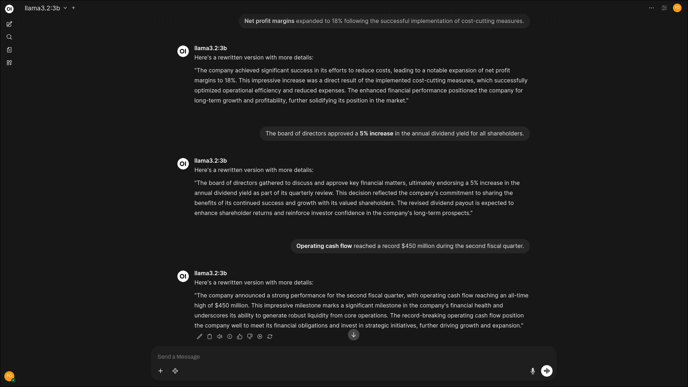
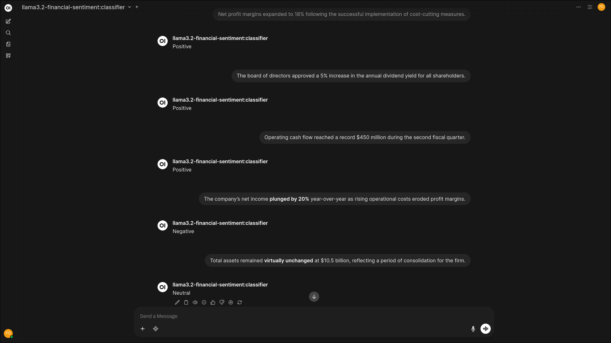
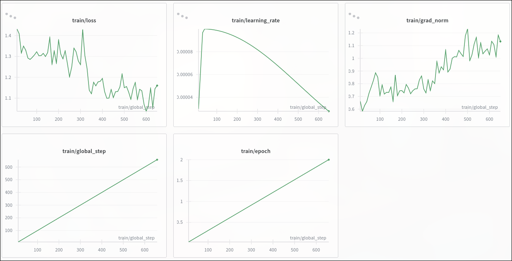

<div align="center">

# Llama 3.2 Financial Sentiment Analysis

### Fine-Tuning with QLoRA + Unsloth

<a href="https://llama.meta.com/"></a>
<a href="https://github.com/unslothai/unsloth"></a>
<a href="https://huggingface.co/docs/peft"></a>
<a href="https://colab.research.google.com/drive/1I2_FX7USgFMyROr29oaEljxd1QoubYD-?usp=sharing"></a>
<a href="https://wandb.ai/"></a>

*Fine-tuning Llama-3.2-3B-Instruct for 3-class financial sentiment classification using 4-bit QLoRA*

</div>

---

## Results at a Glance

| Metric | Score |
|--------|-------|
| **Validation Accuracy** | 83.42% |
| **Macro F1 Score** | 81.57% |
| **Trainable Parameters** | 24.3M (0.75%) |
| **Fine-Tuning Time** | ~2h 50 min on T4 GPU |

---

## Before vs After Fine-Tuning

The difference between the base model and the fine-tuned model is striking. Before fine-tuning, Llama 3.2 3B produces verbose, paragraph-long responses when asked to classify financial sentiment. After fine-tuning, it responds with exactly one word, just as instructed.

<table>
<tr>
<td width="50%" align="center">
<h4>Before Fine-Tuning</h4>
</td>
<td width="50%" align="center">
<h4>After Fine-Tuning</h4>
</td>
</tr>
<tr>
<td>



</td>
<td>



</td>
</tr>
</table>

The base model understands the task conceptually but cannot resist elaborating. It rewrites the input, provides context, and offers detailed analysis. This is typical of instruction-tuned models, they are trained to be helpful and thorough.

The fine-tuned model exhibits the exact behavior I wanted: single-word classifications. **Positive**, **Negative**, or **Neutral**. No explanation, no hedging, just the answer. This is what makes it production-ready, the output is deterministic and parseable.

---

## The Story Behind This Project

### Why Financial Sentiment Analysis?

In the world of quantitative finance and algorithmic trading, **sentiment is signal**. Every day, millions of financial texts, earnings reports, analyst notes, tweets and news headlines flood the market. Behind each piece of text lies a sentiment that can move markets: bullish optimism, bearish fear, or careful neutrality.

I built this project to explore a fundamental question: **Can we teach a large language model to read financial text the way a seasoned analyst would?**

Traditional sentiment analysis tools often fail on financial text. Words like "beat" (earnings beat expectations) or "short" (short selling) carry domain-specific meanings that general-purpose models miss. A headline like *"Company cuts guidance"* requires understanding that "cuts" in this context signals negativity, not just literal cutting.

This is where fine-tuning a modern LLM like Llama 3.2 becomes powerful, we're not just pattern matching, we're teaching the model the *language of finance*.

### Why This Dataset?

I chose the [Financial Sentiment Analysis](https://www.kaggle.com/datasets/sbhatti/financial-sentiment-analysis)  dataset from Kaggle for several strategic reasons:

1. **Real-World Diversity**: The dataset contains ~5.8K samples spanning earnings calls, financial news, Twitter/X posts, and analyst reports. This diversity is crucial, a model trained only on formal news would fail on casual market commentary like *"$TSLA to the moon"*.

2. **Clean 3-Class Labels**: Positive, Negative, and Neutral. This mirrors how actual financial analysts think. No ambiguous 5-star scales or continuous scores, just clear, actionable classifications.

3. **Challenging Class Imbalance**: With 53.6% Neutral, 31.7% Positive, and only 14.7% Negative samples, the dataset reflects real-world financial text distribution. Most market commentary is factual (neutral). The scarcity of negative samples makes the model work harder to learn bearish signals, exactly the kind of challenge that separates good models from great ones.

4. **Appropriate Scale**: At ~5.2K training samples, this dataset is small enough to fine-tune on free Colab GPUs in minutes, yet large enough to achieve meaningful generalization. It's the perfect proving ground for demonstrating efficient fine-tuning techniques.

---

## Project Overview

This project fine-tunes **Meta's Llama-3.2-3B-Instruct** model for financial sentiment analysis using **QLoRA** (Quantized Low-Rank Adaptation) with the **Unsloth** library for 2x faster training.

### Task Definition

Given a financial text (news headline, tweet, or report excerpt), classify the sentiment as:

- **Positive** — Bullish signals, growth, profit increases
- **Negative** — Bearish signals, losses, layoffs, declines  
- **Neutral** — Factual statements without clear sentiment

---

## Training Configuration

### Why Llama 3.2 3B?

Choosing the right base model is like choosing the right foundation for a building. Here's why Llama 3.2 3B was the optimal choice:

| Factor | Reasoning |
|--------|-----------|
| **Size Sweet Spot** | At 3 billion parameters, it's large enough to understand nuanced financial language but small enough to fine-tune on consumer GPUs. The 8B and 70B variants would require enterprise hardware. |
| **Instruction-Tuned** | The `-Instruct` variant already understands conversational prompts, reducing the amount of task-specific learning needed. We're teaching it *what* to analyze, not *how* to follow instructions. |
| **Recent Architecture** | Llama 3.2 (released late 2024) incorporates the latest transformer optimizations, grouped-query attention, RMSNorm, and SwiGLU activations making it more efficient than older models. |
| **Open Weights** | Meta's open license allows commercial use and modification, essential for real-world deployment. |

### Model & Quantization

| Parameter | Value |
|-----------|-------|
| **Base Model** | `unsloth/Llama-3.2-3B-Instruct-bnb-4bit` |
| **Quantization** | 4-bit NF4 (bitsandbytes) |
| **Max Sequence Length** | 256 tokens |
| **Precision** | FP16 (Tesla T4) |

> [!NOTE]
> **Why 4-bit Quantization?**  
> Full-precision Llama 3.2 3B requires ~12GB of VRAM just for model weights. By quantizing to 4-bit NF4, we reduce memory to ~3GB, leaving headroom for gradients and activations. The key insight is that 4-bit quantization preserves most of the model's capability while making fine-tuning accessible on free-tier GPUs. Studies show NF4 (Normal Float 4) quantization retains 99%+ of model quality compared to full precision.

### LoRA Hyperparameters

| Parameter | Value |
|-----------|-------|
| **Rank (r)** | 16 |
| **Alpha** | 16 |
| **Dropout** | 0.0 |
| **Bias** | None |
| **Target Modules** | `q_proj`, `k_proj`, `v_proj`, `o_proj`, `gate_proj`, `up_proj`, `down_proj` |

> [!NOTE]
> **The Philosophy Behind These LoRA Settings**  
> 
> **Rank = 16**: Think of LoRA rank as the "expressiveness budget" for adaptation. Rank 4-8 works for simple tasks like style transfer. Rank 16-32 is ideal for semantic tasks like sentiment where the model needs to rewire how it interprets meaning. Higher ranks (64+) offer diminishing returns and risk overfitting on small datasets.
> 
> **Alpha = 16 (α/r = 1)**: The alpha/rank ratio controls how much the LoRA updates influence the frozen weights. A ratio of 1.0 is the "neutral" setting the adaptations have balanced influence. Higher ratios (α/r = 2) make LoRA more aggressive but can destabilize training.
> 
> **Zero Dropout**: Controversial choice? Not really. Traditional dropout prevents overfitting by randomly zeroing activations. But QLoRA already introduces *implicit regularization* through quantization noise the 4-bit representation naturally adds stochasticity. Adding dropout on top would over-regularize and slow convergence.
> 
> **All 7 Target Modules**: Many tutorials only target attention layers (q, k, v, o). I chose to also include the MLP layers (gate, up, down) because sentiment classification requires both:
> - **Attention rewiring**: Learning which tokens in financial text are sentiment-bearing
> - **Feature transformation**: Learning how to map financial concepts to sentiment outputs
> 
> Training 24.3M parameters (0.75% of the model) is the sweet spot, enough capacity to adapt, not enough to memorize.

### Training Hyperparameters

| Parameter | Value |
|-----------|-------|
| **Planned Epochs** | 3 |
| **Actual Epochs** | 2 (early stopped) |
| **Batch Size** | 4 |
| **Gradient Accumulation** | 4 steps |
| **Effective Batch Size** | 16 |
| **Learning Rate** | 1e-4 |
| **LR Scheduler** | Cosine |
| **Warmup Ratio** | 0.03 |
| **Weight Decay** | 0.0 |
| **Optimizer** | AdamW |
| **Max Gradient Norm** | 1.0 |

> [!NOTE]
> **Why These Training Choices?**
> 
> **Effective Batch Size of 16**: With 5,257 training samples, an effective batch of 16 means ~329 gradient updates per epoch. This provides enough updates for the cosine scheduler to work properly while keeping each update stable with multiple samples.
> 
> **Learning Rate 1e-4**: This is the "Goldilocks zone" for LoRA fine-tuning. Lower (1e-5) would require more epochs to converge. Higher (5e-4+) risks overshooting and unstable training. 1e-4 allows rapid initial learning that naturally decelerates as the cosine schedule kicks in.
> 
> **Cosine Scheduler with 3% Warmup**: The first ~10 steps gradually increase LR from 0 to 1e-4, preventing early training instabilities. Then the cosine decay smoothly reduces LR, allowing fine-grained refinement in later steps. This is superior to linear decay for tasks where we want aggressive early learning followed by careful polishing.
> 
> **No Weight Decay**: Weight decay penalizes large weights to prevent overfitting. But with QLoRA's built-in regularization (quantization noise) and our small dataset, additional regularization isn't needed. Zero weight decay lets the LoRA adapters find the optimal magnitude naturally.

---

## Training Metrics Analysis

<div align="center">



*Weights & Biases training dashboard showing key metrics across ~658 training steps*

</div>

### Reading the Training Story

Looking at these charts is like reading the biography of the training run. Each metric tells part of the story:

### Metric Breakdown

| Chart | Description |
|-------|-------------|
| **train/loss** | Cross-entropy loss dropped from **~1.45 → ~1.10** over training. Initial rapid descent in first 100 steps, then gradual convergence with some oscillation around the 1.1-1.2 range. |
| **train/learning_rate** | Cosine schedule with warmup. Peaks at **1e-4** around step 100 after 3% warmup, then smoothly decays toward zero. |
| **train/grad_norm** | Gradient norms fluctuate between **0.6-1.2**, indicating stable training without exploding gradients. The max_grad_norm=1.0 clipping is rarely triggered. |
| **train/global_step** | Linear progression confirming 658 total steps completed (329 steps/epoch × 2 epochs). |
| **train/epoch** | Shows training completed 2 full epochs before early stopping. |

### Deep Dive: What the Loss Curve Reveals

The loss trajectory tells a fascinating story:

**Steps 0-100 (The Awakening)**: Loss drops sharply from ~1.45 to ~1.25. This is the model's "aha moment" it's rapidly learning that financial sentiment is a structured task with three clear outputs. The instruction-tuned base already knows language; it's now learning *this specific* classification task.

**Steps 100-300 (The Grind)**: Loss continues declining but with noticeable oscillation. This variance isn't noise, it's the model encountering different batch compositions. Some batches are "easy" (clear sentiment), others are "hard" (ambiguous financial jargon). The overall trend remains downward.

**Steps 300-500 (The Plateau Begins)**: Loss stabilizes around 1.15-1.20. The easy gains are captured. Further improvement requires the model to handle edge cases, sarcasm in tweets, domain-specific idioms, mixed-sentiment texts.

**Steps 500-658 (Diminishing Returns)**: Loss oscillates between 1.10-1.20 with no clear trend. The model has extracted most learnable signal from the data. Continuing further risks fitting to noise rather than patterns.

> [!IMPORTANT]
> **Why I Stopped Fine-tuning at Epoch 2**  
> 
> I was intentionally stopped fine-tuning after epoch 2. Here's the reasoning:
> 
> 1. **Loss Plateau**: The training loss stabilized around 1.10-1.15 with no significant improvement trend visible. Continuing would likely lead to diminishing returns.
> 
> 2. **Validation Performance**: At epoch 2 (checkpoint-658), the model achieved **83.42% accuracy** and **81.57% macro F1** strong results for a 3-class sentiment task on financial text.
> 
> 3. **Overfitting Prevention**: For small datasets (~5.2K samples), extended training often leads to overfitting. The model was already showing signs of memorization with oscillating loss rather than smooth descent. Each additional epoch would increasingly fit training quirks rather than generalizable patterns.
> 
> 4. **The Math of Overfitting**: With ~5.2K samples and 24.3M trainable parameters, we have a parameter-to-sample ratio of ~4,600:1. Deep learning folklore suggests ratios above 100:1 require careful regularization. By epoch 3, the model would likely start memorizing individual training examples.
> 
> 5. **Compute Efficiency**: Given the free T4 GPU constraints on Colab, stopping at a good checkpoint preserves resources while achieving production-quality results. Training epoch 3 would cost ~7 more minutes for potentially negative returns.
> 
> **The 83.42% accuracy at epoch 2 compares favorably to traditional ML baselines (typically 70-75%) and demonstrates that LLM fine-tuning can achieve strong performance with minimal compute.**

---

## Dataset

**Source:** [Financial Sentiment Analysis](https://www.kaggle.com/datasets/sbhatti/financial-sentiment-analysis) (Kaggle)

| Split | Samples | Distribution |
|-------|---------|--------------|
| **Train** | 5,257 | Neutral: 53.6%, Positive: 31.7%, Negative: 14.7% |
| **Validation** | 585 | Stratified 10% split |
| **Total** | 5,842 | — |

### Data Format (JSONL)

```json
{
  "instruction": "You are a financial sentiment analyst. Given the financial text, reply with exactly one word: Positive, Negative, or Neutral.",
  "input": "The company's quarterly revenue exceeded analyst expectations by 12%.",
  "output": "Positive"
}
```

> [!NOTE]
> **Understanding the Class Imbalance**  
> 
> The dataset's imbalance (Neutral > Positive > Negative) isn't a bug, it's a feature. Real financial text is predominantly neutral. Most press releases, earnings reports, and analyst notes aim for objectivity. Positive news is more common than negative because companies prefer to highlight wins and downplay losses.
> 
> The scarcity of negative samples (14.7%) makes learning bearish signals harder but more valuable. A model that can reliably detect negative sentiment in financial text has genuine utility, it can flag potential risks that humans might miss in the flood of daily financial communications.
> 
> The strong macro F1 score (81.57%) indicates the model handles all three classes well, not just the majority class. This is the metric that matters for real-world deployment.

### Data Preprocessing Philosophy

The preprocessing pipeline (`notebooks/dataset_prepare.ipynb`) applies minimal transformations:

1. **URL Removal**: Financial tweets often contain links that don't carry sentiment
2. **Whitespace Normalization**: Ensures consistent tokenization
3. **Label Standardization**: Lowercase + capitalize (e.g., "positive" → "Positive")
4. **Stratified Split**: 90/10 train/val preserving class ratios

I intentionally avoided heavy preprocessing (lemmatization, stopword removal, etc.) because modern LLMs are robust to surface variations. Over-cleaning can actually remove useful signals, the way a word is used (capitalization, punctuation) can carry subtle sentiment cues.

---

## Quick Start

### Run on Google Colab (Recommended)

The complete training pipeline is available as a Colab notebook with free T4 GPU:

[](https://colab.research.google.com/drive/1I2_FX7USgFMyROr29oaEljxd1QoubYD-?usp=sharing)

### Local Setup

```bash
# Clone repository
git clone https://github.com/FamilOrujov/llm-finetuning-lab.git
cd llm-finetuning-lab/llama3-financial-sentiment-analysis-ft-unsloth

# Install PyTorch with CUDA 12.6
pip install -r requirements-torch-cu126.txt

# Install dependencies
pip install -r requirements.txt

# Run training
python src/scripts/train.py ./data ./outputs --epochs 3 --batch_size 4 --use_wandb

# Run evaluation
python src/scripts/evaluate.py --model_path ./outputs/final --data_dir ./data
```

---

## Project Structure

```
llama3-financial-sentiment-analysis-ft-unsloth/
│
├── data/
│   ├── data.csv                    # Raw dataset (5,842 samples)
│   ├── train_dataset.jsonl         # Processed training data
│   └── val_dataset.jsonl           # Processed validation data
│
├── notebooks/
│   ├── dataset_prepare.ipynb       # Data preprocessing pipeline
│   └── llama3-ft-colab.ipynb       # Colab notebook link
│
├── src/scripts/
│   ├── train.py                    # Local training script
│   └── evaluate.py                 # Model evaluation script
│
├── assets/
│   └── wb_training_analysis.png    # W&B training metrics
│
├── requirements.txt                # Main dependencies
├── requirements-torch-cu126.txt    # PyTorch CUDA 12.6
└── README.md
```

---

## Inference Example

```python
from unsloth import FastLanguageModel

# Load fine-tuned model
model, tokenizer = FastLanguageModel.from_pretrained(
    model_name="path/to/checkpoint",
    max_seq_length=256,
    load_in_4bit=True,
)
FastLanguageModel.for_inference(model)

# Predict
def predict_sentiment(text):
    messages = [
        {"role": "system", "content": "You are a financial sentiment analyst. Given the financial text, reply with exactly one word: Positive, Negative, or Neutral."},
        {"role": "user", "content": text},
    ]
    input_ids = tokenizer.apply_chat_template(messages, add_generation_prompt=True, return_tensors="pt").to("cuda")
    outputs = model.generate(input_ids, max_new_tokens=4, do_sample=False)
    return tokenizer.decode(outputs[0][input_ids.shape[1]:], skip_special_tokens=True).strip()

# Examples
print(predict_sentiment("Stock surged 5% after earnings beat"))  # → Positive
print(predict_sentiment("Company announces major layoffs"))       # → Negative
print(predict_sentiment("Markets traded sideways today"))         # → Neutral
```

---

## Tech Stack

| Component | Technology |
|-----------|------------|
| **Base Model** | Meta Llama 3.2 3B Instruct |
| **Fine-Tuning** | QLoRA (4-bit quantization + LoRA) |
| **Framework** | Unsloth + HuggingFace TRL |
| **Quantization** | bitsandbytes NF4 |
| **Tracking** | Weights & Biases |
| **Hardware** | NVIDIA T4 (Colab Free Tier) |

