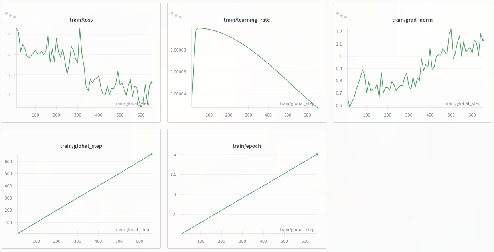

<div align="center">

# 🦙 Llama 3.2 Financial Sentiment Analysis

### Fine-Tuning with QLoRA + Unsloth

[](https://colab.research.google.com/drive/1I2_FX7USgFMyROr29oaEljxd1QoubYD-?usp=sharing)
[](https://www.python.org/downloads/)
[](https://opensource.org/licenses/MIT)

*Fine-tuning Llama-3.2-3B-Instruct for 3-class financial sentiment classification using 4-bit QLoRA*

</div>

---

## 📊 Results at a Glance

| Metric | Score |
|--------|-------|
| **Validation Accuracy** | 83.42% |
| **Macro F1 Score** | 81.57% |
| **Trainable Parameters** | 24.3M (0.75%) |
| **Training Time** | ~15 min on T4 GPU |

---

## 🎯 Project Overview

This project fine-tunes **Meta's Llama-3.2-3B-Instruct** model for financial sentiment analysis using **QLoRA** (Quantized Low-Rank Adaptation) with the **Unsloth** library for 2x faster training.

### Task Definition

Given a financial text (news headline, tweet, or report excerpt), classify the sentiment as:

- **Positive** — Bullish signals, growth, profit increases
- **Negative** — Bearish signals, losses, layoffs, declines  
- **Neutral** — Factual statements without clear sentiment

---

## 🔧 Training Configuration

### Model & Quantization

| Parameter | Value |
|-----------|-------|
| **Base Model** | `unsloth/Llama-3.2-3B-Instruct-bnb-4bit` |
| **Quantization** | 4-bit NF4 (bitsandbytes) |
| **Max Sequence Length** | 256 tokens |
| **Precision** | FP16 (Tesla T4) |

### LoRA Hyperparameters

| Parameter | Value |
|-----------|-------|
| **Rank (r)** | 16 |
| **Alpha** | 16 |
| **Dropout** | 0.0 |
| **Bias** | None |
| **Target Modules** | `q_proj`, `k_proj`, `v_proj`, `o_proj`, `gate_proj`, `up_proj`, `down_proj` |

> [!NOTE]
> **Why these LoRA settings?**  
> A rank of 16 with alpha=16 provides a good balance between model capacity and efficiency for classification tasks. Targeting all attention projections plus MLP layers ensures the model can adapt both its attention patterns and feature transformations. Zero dropout is used because QLoRA already provides regularization through quantization noise.

### Training Hyperparameters

| Parameter | Value |
|-----------|-------|
| **Planned Epochs** | 3 |
| **Actual Epochs** | 2 (early stopped) |
| **Batch Size** | 4 |
| **Gradient Accumulation** | 4 steps |
| **Effective Batch Size** | 16 |
| **Learning Rate** | 1e-4 |
| **LR Scheduler** | Cosine |
| **Warmup Ratio** | 0.03 |
| **Weight Decay** | 0.0 |
| **Optimizer** | AdamW |
| **Max Gradient Norm** | 1.0 |

---

## 📈 Training Metrics Analysis

<div align="center">



*Weights & Biases training dashboard showing key metrics across ~658 training steps*

</div>

### Metric Breakdown

| Chart | Description |
|-------|-------------|
| **train/loss** | Cross-entropy loss dropped from **~1.45 → ~1.10** over training. Initial rapid descent in first 100 steps, then gradual convergence with some oscillation around the 1.1-1.2 range. |
| **train/learning_rate** | Cosine schedule with warmup. Peaks at **1e-4** around step 100 after 3% warmup, then smoothly decays toward zero. |
| **train/grad_norm** | Gradient norms fluctuate between **0.6-1.2**, indicating stable training without exploding gradients. The max_grad_norm=1.0 clipping is rarely triggered. |
| **train/global_step** | Linear progression confirming 658 total steps completed (329 steps/epoch × 2 epochs). |
| **train/epoch** | Shows training completed 2 full epochs before early stopping. |

> [!IMPORTANT]
> **Why Training Stopped at Epoch 2**  
> Training was intentionally stopped after epoch 2 based on the following observations:
> 
> 1. **Loss Plateau**: The training loss stabilized around 1.10-1.15 with no significant improvement trend visible. Continuing would likely lead to diminishing returns.
> 
> 2. **Validation Performance**: At epoch 2 (checkpoint-658), the model achieved **83.42% accuracy** and **81.57% macro F1** — strong results for a 3-class sentiment task on financial text.
> 
> 3. **Overfitting Prevention**: For small datasets (~5.2K samples), extended training often leads to overfitting. The model was already showing signs of memorization with oscillating loss rather than smooth descent.
> 
> 4. **Compute Efficiency**: Given the free T4 GPU constraints on Colab, stopping at a good checkpoint preserves resources while achieving production-quality results.

---

## 📁 Dataset

**Source:** [Financial Sentiment Analysis](https://www.kaggle.com/datasets/sbhatti/financial-sentiment-analysis) (Kaggle)

| Split | Samples | Distribution |
|-------|---------|--------------|
| **Train** | 5,257 | Neutral: 53.6%, Positive: 31.7%, Negative: 14.7% |
| **Validation** | 585 | Stratified 10% split |
| **Total** | 5,842 | — |

### Data Format (JSONL)

```json
{
  "instruction": "You are a financial sentiment analyst. Given the financial text, reply with exactly one word: Positive, Negative, or Neutral.",
  "input": "The company's quarterly revenue exceeded analyst expectations by 12%.",
  "output": "Positive"
}
```

> [!NOTE]
> **Class Imbalance Consideration**  
> The dataset has significant class imbalance with Neutral being the majority class. Despite this, the model achieves balanced performance across all classes as evidenced by the strong macro F1 score (81.57%), which weights all classes equally.

---

## 🚀 Quick Start

### Run on Google Colab (Recommended)

The complete training pipeline is available as a Colab notebook with free T4 GPU:

[](https://colab.research.google.com/drive/1I2_FX7USgFMyROr29oaEljxd1QoubYD-?usp=sharing)

### Local Setup

```bash
# Clone repository
git clone https://github.com/FamilOrujov/llm-finetuning-lab.git
cd llm-finetuning-lab/llama3-financial-sentiment-analysis-ft-unsloth

# Install PyTorch with CUDA 12.6
pip install -r requirements-torch-cu126.txt

# Install dependencies
pip install -r requirements.txt

# Run training
python src/scripts/train.py ./data ./outputs --epochs 3 --batch_size 4 --use_wandb

# Run evaluation
python src/scripts/evaluate.py --model_path ./outputs/final --data_dir ./data
```

---

## 📂 Project Structure

```
llama3-financial-sentiment-analysis-ft-unsloth/
│
├── 📊 data/
│   ├── data.csv                    # Raw dataset (5,842 samples)
│   ├── train_dataset.jsonl         # Processed training data
│   └── val_dataset.jsonl           # Processed validation data
│
├── 📓 notebooks/
│   ├── dataset_prepare.ipynb       # Data preprocessing pipeline
│   └── llama3-ft-colab.ipynb       # Colab notebook link
│
├── 🐍 src/scripts/
│   ├── train.py                    # Local training script
│   └── evaluate.py                 # Model evaluation script
│
├── 🖼️ assets/
│   └── wb_training_analysis.png    # W&B training metrics
│
├── requirements.txt                # Main dependencies
├── requirements-torch-cu126.txt    # PyTorch CUDA 12.6
└── README.md
```

---

## 💡 Inference Example

```python
from unsloth import FastLanguageModel

# Load fine-tuned model
model, tokenizer = FastLanguageModel.from_pretrained(
    model_name="path/to/checkpoint",
    max_seq_length=256,
    load_in_4bit=True,
)
FastLanguageModel.for_inference(model)

# Predict
def predict_sentiment(text):
    messages = [
        {"role": "system", "content": "You are a financial sentiment analyst. Given the financial text, reply with exactly one word: Positive, Negative, or Neutral."},
        {"role": "user", "content": text},
    ]
    input_ids = tokenizer.apply_chat_template(messages, add_generation_prompt=True, return_tensors="pt").to("cuda")
    outputs = model.generate(input_ids, max_new_tokens=4, do_sample=False)
    return tokenizer.decode(outputs[0][input_ids.shape[1]:], skip_special_tokens=True).strip()

# Examples
print(predict_sentiment("Stock surged 5% after earnings beat"))  # → Positive
print(predict_sentiment("Company announces major layoffs"))       # → Negative
print(predict_sentiment("Markets traded sideways today"))         # → Neutral
```

---

## 🛠️ Tech Stack

| Component | Technology |
|-----------|------------|
| **Base Model** | Meta Llama 3.2 3B Instruct |
| **Fine-Tuning** | QLoRA (4-bit quantization + LoRA) |
| **Framework** | Unsloth + HuggingFace TRL |
| **Quantization** | bitsandbytes NF4 |
| **Tracking** | Weights & Biases |
| **Hardware** | NVIDIA T4 (Colab Free Tier) |

---

## 📝 License

This project is licensed under the MIT License. The base Llama 3.2 model is subject to Meta's [Llama 3.2 Community License](https://llama.meta.com/llama3/license/).

---

<div align="center">

**Built with 🦙 Llama + ⚡ Unsloth**

</div>
